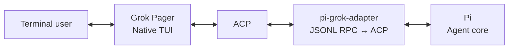
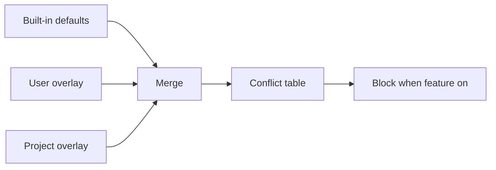

Product target: **one native Rust TUI for Pi, with no Grok business runtime**.
The governing [SPEC](docs/issues/架构/20261003-pi-native-tui-SPEC.md) and
[PLAN](docs/issues/架构/20261003-pi-native-tui-PLAN.md) track T0–T8. Grok Build is
a reference for selected UI ports; its stock profile and business dependencies
are being removed. Earlier cuts are historical checkpoints, not terminal acceptance.
See the [verification report](docs/VERIFICATION.md) for current pending work.


# grok-pi — A native Rust TUI for Pi

> Pi models, tools and sessions in Grok Pager's native terminal UI.

[Download latest release](https://github.com/Dwsy/grok-pi/releases/latest) · [ZH](docs/README.zh-CN.md) · [Feature matrix](docs/FEATURE_MATRIX.md) · [Architecture](docs/NATIVE_GROK_TUI_ALIGNMENT.md) · [Verification](docs/VERIFICATION.md) · [Changelog](CHANGELOG.MD) · [更新日志](docs/CHANGELOG.zh-CN.md)

> **Pi core, native Pager UI, configurable extensions.** Grok Pager supplies the terminal experience; Pi supplies models, provider authentication, tools, sessions and runtime controls. Bundled Pi extensions add features such as Todo and Subagents, with their own defaults and capability boundaries.

`grok-pi` connects Pi's agent runtime to Grok Pager. The external product surface excludes Grok voice/STT/TTS, account/billing, training/retention and stock agent/plugin/MCP controls. F2, the command palette and the Web host-settings catalog share that boundary. Provider authentication uses Pi's `/login` and `/logout`; no Grok account is required.

## Install

### macOS / Linux

```bash
curl -fsSL https://github.com/Dwsy/grok-pi/releases/latest/download/install.sh | sh
```

### Windows

```powershell
irm https://github.com/Dwsy/grok-pi/releases/latest/download/install.ps1 | iex
```

The installer picks the matching release asset and installs `grok-pi`:

| Platform | Asset |
|---|---|
| macOS Apple Silicon | `grok-pi-macos-aarch64.tar.gz` |
| macOS Intel | `grok-pi-macos-x86_64.tar.gz` |
| Linux x86_64 | `grok-pi-linux-x86_64.tar.gz` |
| Linux ARM64 | `grok-pi-linux-aarch64.tar.gz` |
| Windows x64 | `grok-pi-windows-x86_64.zip` |
| Windows ARM64 | `grok-pi-windows-aarch64.zip` |

Defaults: Unix → `~/.local/bin`; Windows → `%LOCALAPPDATA%\grok-pi\bin`. Override with `GROK_PI_INSTALL_DIR`. To install a specific stable or beta release, use `GROK_PI_VERSION=vX.Y.Z` or `GROK_PI_VERSION=vX.Y.Z-beta.N` with the installer from that same release tag.

```bash
# Example: install a specific beta on macOS / Linux
curl -fsSL https://github.com/Dwsy/grok-pi/releases/download/v1.2.0-beta.1/install.sh | \
  GROK_PI_VERSION=v1.2.0-beta.1 sh
```

The installer also creates `pig` and `pi-grok` aliases (Unix symlinks; Windows `pig.exe` / `pi-grok.exe` hardlinks with copy fallback):

```bash
pig --help       # short alias
grok-pi --help   # original name
pi-grok --help   # alias
```

`grok-pi` requires [Pi](https://pi.dev) **1.0.0 or newer** (system `pi` / pi.dev installer):

```bash
# recommended
curl -fsSL https://pi.dev/install.sh | sh
# Windows:
# powershell -c "irm https://pi.dev/install.ps1 | iex"
# or npm:
npm install --global @earendil-works/pi-coding-agent
```

On Windows, if an older `grok-pi.exe` cannot find bare `pi`, point it at the shim:

```powershell
$env:PI_BIN = "$env:LOCALAPPDATA\pi-node\current\pi.cmd"
grok-pi --pi-bin $env:PI_BIN
```

## Start

From any project directory:

```bash
grok-pi
# or
pig
# or
pi-grok
```

Defaults: system `pi` on PATH, current working directory as the project. Continue the previous session with `grok-pi --continue`.

Useful commands:

```bash
grok-pi --help
grok-pi update --check
grok-pi update
grok-pi update --channel beta    # persist beta in ~/.grok-pi/config.toml
grok-pi update --channel stable  # switch back; stable is the default
```

Update channels are product-local and persisted in `~/.grok-pi/config.toml` under `[update].channel`. `stable` is the default and never selects prereleases. `beta` follows valid `-beta.N` GitHub prereleases, but will also advance to a newer final release when semver makes it the newer target. `grok-pi --version` shows the active channel, and `grok-pi update --check --json` includes the resolved `channel`.

## What it provides

| Area | Included |
|---|---|
| Agent runtime | Pi models, providers, tools, extensions, skills, sessions, retries, and compaction |
| Provider authentication | Thin native UI bridge to Pi ModelRuntime login/logout. Pi owns provider methods, credentials and MCP configuration; generic Radius login stays available, with no bridge-written `mcp.json` or provider-specific setup. |
| Model management | `/pi-models` provides a native Provider → Model → Details editor with safe `models.json` transactions, backup/restore, live Pi reload, and typed activation; `/model` remains the fast switcher |
| Web config workbench | `/pi-config web` / `/pi-models web`: zh/en workbench for model/provider configuration, resource paths, Pi settings and the filtered Pager UI settings catalog. Served by the Pi extension on a token-gated loopback port. |
| Terminal UI | Grok Pager input, slash completion, Markdown, tool cards, diffs, dialogs, and scrollback |
| Product tutorial | `/tutorial` (aliases `/tour`, `/onboarding`) covers 18 areas: native Pager controls, Pi providers/models/tools/sessions, extensions/Skills/Packages and optional automation with explicit boundaries |
| Remote TUI compatibility | Experimental host for supported Pi `ctx.ui.custom` interactions in Pager; enabled by default, with per-component compatibility limits |
| Extended shell execution | Bundled Pi Bash/Eval extension for background tasks, output limits, timeouts and process-tree cleanup |
| Parallel work | Bundled Subagents extension using Pi child sessions, enabled by default; native task views and product-isolated agent definitions. Optional Subagents V2 adds stable `/root/...` agent paths, peer messaging, nested spawn and team presets under `.grok-pi/teams` / `~/.grok-pi/teams` |
| Rhai workflows | Optional `xai-workflow` host using Pi workers, off by default (F2 **Pi workflows**); scripts under `~/.grok-pi/workflows` and `<repo>/.grok-pi/workflows`. This orchestration has not migrated to Pi core. |
| Session workflow | Resume, tree navigation, labels, recap, context inspection, and session picker |
| Resource management | `/pi-config` manages Pi resources and package install/remove/update through the selected official Pi CLI, then reloads and shows the live registry. Global/Project trust, filters and pins remain Pi-owned; local removal retains source directories. |
| Pi runtime controls | `/pi-runtime` inspects runtime status, configures automatic retry/compaction, and cancels a retry delay. Live compaction and configured retry policy are identified separately. |
| Updates | Isolated `stable` / `beta` GitHub Release channels, persisted under `~/.grok-pi/config.toml`; channel-aware background checks, `grok-pi update`, `--check --json`, and target-tag installer downloads |

The earlier deep-adaptation checkpoint passed automatic build/verify and four native PTYs. One configured-default real SDK chat returned OK with unchanged credential/config bytes. These are historical results; current product-surface validation is recorded separately in [VERIFICATION](docs/VERIFICATION.md). Real-provider native UI, human OAuth, real image generation and target-terminal acceptance remain separate layers.

Pi is the authority for provider/model behavior, authentication, tools, sessions, retry and compaction; Pager presents their controls and results. Todo, Plan, Goal, extended Bash/Eval and Subagents are grok-pi extensions or integrations, rather than Pi built-ins. Adapter queue interception, Plan/Goal state and optional Rhai orchestration remain ownership work tracked in the current PLAN; this UI cut does not report them as migrated.

Commands are organized by responsibility:

| Area | grok-pi entry points |
|---|---|
| Pi models and providers | `/model`, `/effort`, `/login`, `/logout`, `/pi-models` |
| Pi sessions and context | `/new`, `/resume`, `/rename`, `/session`, `/tree`, `/fork`, `/clone`, `/compact` |
| Pi resources and runtime | `/pi-config`, `/reload`, `/pi-runtime`; loaded extension, prompt and `/skill:name` commands |
| Native terminal UI | `/settings` / F2, `/theme`, `/hotkeys`, `/tutorial`, `/copy`, `/find`, `/transcript` |

Pi's interactive command names and settings guide the integration; grok-pi retains Pager names such as `/effort` and `/rename`. Its F2 panel is the native Pager settings surface, not a copy of Pi's interactive settings component.

F2 → Appearance → Settings language selects Follow system (default), 简体中文, or English. Setting names, descriptions, choices and panel controls use the selected language; searches accept Chinese and English. The preference is `[ui].language = "auto" | "zh-CN" | "en"` in the product's `config.toml`, shared with the Web configuration workbench. Feature names describe behavior: Team collaboration, Task dependencies and reminders, and Code execution mode. Existing `*_v2` keys and stored execution values remain compatible. This language preference covers the settings interface.

For field-level behavior and intentional omissions, see the [feature matrix](docs/FEATURE_MATRIX.md).

Native package changes recompute policy-controlled startup admission. Unchanged inputs use official Pi reload; changed inputs restart after official disposal and restore the public session, leaf, model and thinking state. Without a persistent session file or when a user-message leaf cannot be safely restored, changes stay saved/deferred until the response finishes or the user restarts. The final native package fixture verifies the composed install/remove loop and history preservation.

Package command completion, Pi reload and verified live command/tool registry entries are separate states. Pi 1.0 RPC does not expose the resource loader's complete errors, so grok-pi reports package load status as unverified. The Web settings editor retains its current-state preflight and requires a server revision (`If-Match`); an external change already present at save time is rejected. Its short compare/replace interval does not exclude simultaneous writes by external editors.

Virtual model selection stays in `/model`; a separate native status shows the dispatched physical model and thinking level when Pi reports them. Image/classifier models use Pi's official model runtime and stay outside the chat picker. Synthetic SDK/RPC checks are separate from real provider, OAuth and terminal acceptance; see the [deep-adaptation record](docs/issues/架构/20261003-pi-deep-adaptation-PLAN.md).

## Architecture



The integration has three boundaries:

- **Grok Pager** owns terminal lifecycle, input, rendering, dialogs, and visible UI.
- **Pi** owns the agent loop, models, providers, tools, extensions, and sessions.
- **`pi-grok-adapter`** is a headless JSONL RPC ↔ ACP bridge. It does not own a terminal or render a second UI.

Pi source is not modified. Public RPC and extension APIs provide the primary integration; the experimental Remote TUI compatibility host also uses scoped host hooks for capabilities unavailable in stock RPC.

`/pi-ui-capabilities` lists standard native mappings, limited mappings, experimental Remote TUI and unsupported methods. Working-message visibility/indicator changes map to the native status surface; animated indicators, persistent header/footer/widget factories and raw input/editor replacement remain bounded by Pi RPC. The experimental mode facade only activates with the actual Remote TUI host; it does not establish compatibility with every third-party component.

Custom components own keyboard input until they close, including letter actions,
paste, and ordinary `Esc` (handled by the component). Native Pi input/confirmation
dialogs temporarily take priority. `Ctrl+Shift+Esc` force-closes a stuck remote
component when the terminal reports that chord distinctly. Transport metadata is
isolated per Grok-Pi process, and stale component input is discarded. Plugins
should use Pi's key parsers for modified keys; raw string comparisons do not
recognize every terminal encoding.
Plain Shift+letter presses are forwarded as uppercase text (for example, `S`)
for compatibility with literal Pi component actions. Other modified presses
retain their modifiers; repeat and release events remain distinct.

## Configuration

Bundled bridge extensions are enabled by default where stable. Experimental native commands are opt-in.

| Variable | Default | Purpose |
|---|---:|---|
| `PI_GROK_REMOTE_TUI` | `1` | Enable Pi `ctx.ui.custom` components |
| `PI_GROK_BASH` | `1` | Enable the bundled Pi Bash integration |
| `PI_GROK_NATIVE_COMMANDS` | `0` | Enable experimental `/pi-*` commands |
| `PI_GROK_SUBAGENTS_V2` | `0` | Enable optional V2 team tools (`spawn_team`, stable agent paths, peer messaging, nested spawn) on top of Pi subagents |
| `GROK_HOME` | `~/.grok-pi` | User state root (isolated from stock Grok `~/.grok`) |
| `GROK_PROJECT_DIR` | `.grok-pi` | Project config/workflows/hooks dir name under repo root |
| `GROK_PI_NO_AUTO_UPDATE` | unset | Disable background update checks |

Subagents V2 team presets are JSON files under `<repo>/.grok-pi/teams` or `~/.grok-pi/teams` (project overrides global, which overrides bundled presets). Agent profiles remain external Markdown under the matching `agents/` directories. Example:

```json
{
  "name": "implementation",
  "description": "Implementation plus review",
  "members": [
    { "name": "implementer", "agent": "general-purpose", "task": "Implement: {{task}}" },
    { "name": "reviewer", "agent": "explore", "task": "Review: {{task}}" }
  ]
}
```

Enable V2 before starting grok-pi with the F2 "Pi subagents V2" toggle or `PI_GROK_SUBAGENTS_V2=1`; use `/subagent-teams` to inspect presets. `spawn_team` starts a preset, while `spawn_team_agent`, `team_send_message`, `team_followup_task`, `team_wait`, `team_list`, and `team_interrupt` provide the lower-level collaboration surface. Rhai Workflow remains the deterministic orchestration engine; Team V2 is the session-scoped, run-reusable agent identity/messaging layer.

Rhai workflows are **off by default** (F2 → Agent → **Pi workflows**, then full restart). Details: [FEATURE_MATRIX.md](docs/FEATURE_MATRIX.md), [AGENTS.md](AGENTS.md#product-state-isolation).

Herdr lifecycle reporting is **off by default**. Enable it with F2 → Agent → **Pi Herdr integration**, then restart. See the [Herdr setup guide](docs/usage/grok-pi-herdr.md).

Use `--no-extensions` (`-ne`) to disable Pi extension auto-discovery; explicit `-e` paths and grok-pi host bridges still load. Use `--no-bridge-extensions` to disable the bundled host bridges, or combine both flags for a fully extension-free launch. Pi startup options can be passed directly after `--`.

```bash
grok-pi -- --model openai/gpt-4o
```

## Build from source

Requirements: Rust **1.92.0**, Node.js **22.19.0 or newer**, npm, and a system Pi installation.

```bash
./build.sh
./target/debug/grok-pi
# or: PI_BIN=pi ./run-local.sh
```

Project Cargo commands should go through `./scripts/cargo-shared.sh`: incremental
compilation is enabled by default, the generated target is capped at 128 GiB, and
Cargo stops before free space falls below 20 GiB. Override the target cap with
`CARGO_TARGET_MAX_GIB`; periodic maintenance clears incremental caches first and runs
`cargo clean` if an already-over-cap target remains too large. Override
`CARGO_MIN_FREE_GIB` only deliberately; set `CARGO_MAINTENANCE=0` to skip one
pre-command maintenance pass. The running disk guard continuously enforces the
free-space floor; target-size maintenance runs on its configured cadence.

Run verification with:

```bash
./verify.sh
```

See [VERIFICATION.md](docs/VERIFICATION.md) for the distinction between static checks and runtime acceptance.

## Documentation

- [Feature matrix](docs/FEATURE_MATRIX.md) — supported behavior and intentional boundaries
- [Eval v2 / Pi Codemode / MCP plan](docs/issues/adapter/20260930-Eval%20v2%20学习%20Pi%20Codemode%20并复用%20MCP.md) — official nested execution, opt-in Pi MCP and runtime boundaries
- [Subagents V2 guide](docs/usage/subagents-v2.md) — opt-in team collaboration, stable paths, presets, queue semantics, rollback, and troubleshooting
- [Architecture alignment](docs/NATIVE_GROK_TUI_ALIGNMENT.md) — component ownership, protocol mapping, and migration guidance
- [Verification record](docs/VERIFICATION.md) — completed checks and known environment blockers
- [Changelog](CHANGELOG.MD) / [更新日志](docs/CHANGELOG.zh-CN.md) — release history (EN / ZH)
- [Contributing](CONTRIBUTING.md) — contribution guidelines

## License

See [LICENSE](LICENSE) and [THIRD-PARTY-NOTICES](THIRD-PARTY-NOTICES) for project and upstream notices.

## Native feature switches → blocked Pi extensions

When a native grok-pi capability is **on**, the host resource policy may block known conflicting Pi packages so tool names / roles do not collide. Built-in defaults live in [`crates/codegen/xai-grok-pager/assets/native_feature_conflicts.toml`](crates/codegen/xai-grok-pager/assets/native_feature_conflicts.toml). Runtime overlays (no rebuild): `$GROK_HOME/native-feature-conflicts.toml`, then `$GROK_PROJECT_DIR/native-feature-conflicts.toml` (package **union**; non-empty `reason` overwrites). User resource `allow` still wins.



| Feature switch | How it turns on | Default | Blocks (npm packages) |
|---|---|---:|---|
| **Q&A** (`pi_ask_user_question`) | F2 → Agent → Q&A (restart) | off | `@juicesharp/rpiv-ask-user-question` |
| **Q&A desktop notifications** (`pi_ask_user_question_notifications`) | F2 → Agent → Q&A desktop notifications | on | — |
| **Pi goal mode** (`pi_goal`) | F2 → Agent → Pi goal mode (restart) | off | `pi-codex-goal`, `@narumitw/pi-goal`, `@misunders2d/pi-goal`, `pi-goal`, `pi-goal-x` |
| **Pi workflows** (`pi_workflows`) | F2 → Agent → Pi workflows (restart) | off | `@quintinshaw/pi-dynamic-workflows` |
| **Pi subagents** (`pi_subagents`) | F2 → Agent → Pi subagents (restart) | on | `pi-subagents`, `@tintinweb/pi-subagents`; native `/subagents` config writes isolated global/project Markdown definitions. Optional V2 is separately enabled with the F2 "Pi subagents V2" toggle or `PI_GROK_SUBAGENTS_V2=1`; `/subagent-teams` discovers project/global/bundled JSON presets |
| **`/btw`** (`pi_btw`) | F2 → Agent → Pi /btw (restart); saved answers are viewable with `/btw-history` | off | `pi-btw`, `@narumitw/pi-btw`, `@juicesharp/rpiv-btw` |
| **Markdown user messages** (`pi_user_markdown`) | F2 → Agent → Markdown user messages | on | — |

Eval bridge generations are mutually exclusive and selected at process start. Eval v1 remains the default. Eval Bridge v2 can expose JavaScript, Python, or both:

```toml
[ui]
pi_eval = "v2"
pi_eval_v2_language = "all"       # "js" (default), "py", or "all"
pi_eval_v2_display_mode = "effects" # "effects" (default) or "legacy"
```

Use `pi_eval = "v1"` (or omit the key) for legacy Eval. Eval v1 keeps persistent Python and JavaScript kernels; Eval Bridge v2 uses isolated cells with explicit `store/load` persistence and the selected language set. Because `pi_eval` is a single version selector, v1 and v2 cannot run concurrently. `pi_eval` and `pi_eval_v2_language` are restart-required.

Pi Codemode is an opt-in F2 built-in tool loading Pi's official `builtin:codemode` extension. F2 **Pi MCP** (`pi_mcp`, default off) enables Pi 1.0's built-in MCP and retains Pi trust, resource allowlists, exposure and CLI exclusions. Normal Eval v2 calls use official `ctx.executeTool()`; `await tools.waitFor(pattern, timeout_ms)` observes the public callable registry while servers connect. Pi owns MCP connections, OAuth, registration and permissions. Eval-only hides other top-level declarations with `prepareLoadout.hiddenDeclarations` while keeping allowed tools callable. The separately enabled external Eval MCP facade has no assistant-issued tool context and retains its isolated compatibility path. See the [Pi-first verification](docs/VERIFICATION.md).

`pi_eval_v2_display_mode` is presentation-only and applies immediately: `effects` keeps Eval v2 orchestration source out of the normal transcript and presents its effects/results, while `legacy` restores source + result rendering. Change it from **F2 → Agent → Eval v2 display**, edit `[ui].pi_eval_v2_display_mode`, or use `/eval-display [effects|legacy]`; `/eval-display` with no argument toggles the current mode. The selected mode is persisted for future sessions.

Under `pi_eval_v2_only` the choice decides which card the top level gets: `effects` hides the `eval` card and renders only its nested tool effects, while `legacy` renders the source/result card itself (nested effects still project from the bridge entries). The adapter reads the same key so the live path and session replay agree; a restart-required `pi_eval` version change is unaffected.

Turning Pi subagents off omits the bundled bridge, forces `PI_GROK_SUBAGENTS=0`, and admits conflicting third-party packages again for the next process.

F2 descriptions for the opt-in rows append **When on, blocks: …** from the same table.
