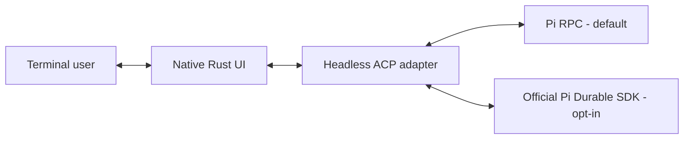

# grok-pi (pig)

**A native Rust terminal client for Pi, independently maintained in this repository.**

Pi runs the agent, models, providers and tools. `pig` provides the terminal interface: editor, settings, model management, session navigation, tool cards, diffs and task views. Its Rust UI originated in Grok Build and has since developed its own Pi integration and product behavior.

Provider access uses Pi credentials. Grok account, billing and voice controls are excluded from this product.

[中文](docs/README.zh-CN.md) · [Releases](https://github.com/kyrosle/grok-pi-tui/releases) · [Changelog](CHANGELOG.MD) · [Feature matrix](docs/FEATURE_MATRIX.md)

## Current source and released binaries

As of **2026-10-08**:

| Distribution | What it contains |
|---|---|
| [Published v0.1.10](https://github.com/kyrosle/grok-pi-tui/releases/tag/v0.1.10) | macOS 14+ Apple Silicon binary, `pig` launcher and bundled libraries. Predates the runtime removals, Durable mode and latest Pi 1.1/native UI changes below. |
| Current development source | Custom Eval retired; official Pi Codemode/MCP integration retained; Pi 1.1 contracts, native viewer improvements and optional Durable SDK 1.1.0 backend. These changes have not been released as a binary. |

The install commands download a **published release**. Build this checkout to use the current development features.

## Install on macOS

Published binaries support **macOS 14 (Sonoma) or newer on Apple Silicon**. Intel Mac, Linux and Windows binaries are not published yet.

Install Node.js **22.19.0+** and [Pi](https://github.com/earendil-works/pi), then grok-pi. Pi **1.0.0+** is the compatible minimum; **1.1.0+** is recommended for the current source's new tool-selection and runtime contracts.

```bash
npm install --global @earendil-works/pi-coding-agent
curl -fsSL https://github.com/kyrosle/grok-pi-tui/releases/latest/download/install.sh | sh
export PATH="$HOME/.local/bin:$PATH"
pig
```

The installer places `grok-pi` and its libraries in `~/.local/bin` and creates `pig` and `pi-grok` symlinks. **Use `pig` for everyday work; no `tpig` launcher is required.** Add the PATH line to `~/.zshrc` once if needed. `GROK_PI_INSTALL_DIR` overrides the install directory.

To pin v0.1.10:

```bash
curl -fsSL https://github.com/kyrosle/grok-pi-tui/releases/download/v0.1.10/install.sh | \
  GROK_PI_VERSION=v0.1.10 sh
```

Release assets include the archive, SHA-256 checksums and bundled-library notices/source archives. Log in to a provider with `/login` after starting the default Pi RPC mode. No Grok account is required.

## Everyday use

Start in the project you want to work on:

```bash
pig
pig --continue
pig --help
```

The default backend launches system `pi` from PATH. Use `--pi-bin /path/to/pi` or `PI_BIN` to select another installation. `--pi-cwd` selects the working directory.

These commands describe **Pi RPC mode**:

| Task | Entry points |
|---|---|
| UI settings and language | F2 or `/settings`; English, 简体中文 and Follow system |
| Models and providers | `/model`, `/effort`, `/login`, `/logout`, `/pi-models` |
| Sessions and context | `/new`, `/resume`, `/rename`, `/session`, `/tree`, `/fork`, `/clone`, `/compact` |
| Resources and runtime | `/pi-config`, `/reload`, `/pi-runtime` |
| Transcript and tool inspection | `/copy`, `/find`, `/transcript`, `/export`; native tool cards, diffs and fullscreen viewers |
| Help | `/hotkeys`, `/tutorial`, `/pi-ui-capabilities` |

`/pi-config web` and `/pi-models web` open the local configuration workbench for Pi settings, providers/models, resource paths and UI settings.

```bash
pig update --check
pig update
pig update --channel beta
pig update --channel stable
```

Updates use this repository's GitHub Releases. The selected `stable`/`beta` channel is saved in the product config; stable excludes prereleases. `GROK_PI_NO_AUTO_UPDATE=1` disables background checks. Updating from a release does not install an unreleased checkout.

## What the current source adds to Pi

| Capability | Current behavior |
|---|---|
| Native terminal UI | Rust input/rendering, Markdown, tool cards, review/diffs, image surfaces, search, transcript and fullscreen inspection |
| Product settings | Dedicated native F2 panel, bilingual labels/search, themes and product-isolated configuration |
| Models and resources | Native provider/model editor and resource manager, local Web workbench, reload and runtime controls |
| Enhanced Bash | Background tasks, output collection, timeout handling and process-tree cleanup; enabled by default |
| Todo and subagents | Bundled Pi extensions with native task/child-session views; enabled by default |
| Team collaboration | Optional Subagents V2 with stable agent paths, messaging and presets; off by default ([guide](docs/usage/subagents-v2.md)) |
| Code orchestration and MCP | Pi's official Codemode and MCP/tool-search extensions; opt-in through F2, off by default |
| Pi 1.1 adaptation | Signed `--tools` selection, Pi-side cancellation, execution duration, pricing tiers and updated Remote TUI cursor markers |
| Terminal state | OSC 7501 working/blocked/done/error reports on supporting terminals; `PI_PROGRAM_STATUS=1` forces it, `0` disables it |
| Durable | Optional official SDK backend for persistent tasks and recovery; experimental and off by default |

For example, with **Pi 1.1+ in RPC mode**:

```bash
pig --tools +codemode,-bash
```

Explicit CLI tool selection takes precedence over saved F2 preferences.

Custom Eval v1/v2, Eval-only mode, the Eval MCP facade, duplicate experimental selectors, the second Rust TUI Bridge and the startup profiler have been removed from current source. Historical Eval cards remain readable. Code orchestration uses Pi Codemode; shell/Python work can use Bash.

Goal/Loop, Q&A, Herdr and Rhai workflows remain optional product extensions/integrations with separate defaults. The detailed [feature matrix](docs/FEATURE_MATRIX.md) records their behavior and limitations.

## Optional Durable mode

**Current development source only.** F2 → Agent → **Durable mode (experimental)** saves `[ui].pi_durable`, default `false`, for the next start. Changing it keeps the current session in its existing backend. CLI flags override that preference for one run.

```bash
pig --durable
pig --durable --continue
pig --no-durable
pig --durable-background
```

Durable uses official Pi SDK **1.1.0**, isolated SQLite stores, committed transcript/tool updates, inboxes, task graphs (`/tasks`), owned foreground subagents and checkpoint recovery. Default UI-owned execution pauses when the UI closes. The explicit Unix background owner continues work after UI detach, accepts one UI and exits after 30 seconds idle without a UI.

Interrupted unsafe tools require inspection before `/durable-recover continue` or `/durable-recover abort`. Recovery abort covers the store's interrupted work. A background owner stays bound to one store.

| Available | Not adapted yet |
|---|---|
| Text conversation, read/write/edit/bash, foreground subagents, model/effort selection, resume, compaction, task inspection and recovery | Ordinary Pi extensions, Codemode, MCP, images, Plan/Goal/Loop, classic tree/fork/clone operations and login UI |

Configure credentials with ordinary `pi` `/login` before using Durable. Skills/context data use public Pi APIs; project data requires `--approve`. RPC JSONL sessions and Durable SQLite stores stay in their original backends, with no hot switch or implicit conversion. Follow the backend-specific resume command printed on exit.

Build the optional host with `GROK_PI_BUILD_DURABLE=1 ./build.sh`. See the [Durable SPEC](docs/issues/架构/20261007-pi-durable-integration-SPEC.md) and [implementation record](docs/issues/架构/20261007-pi-durable-integration-PLAN.md) for SDK/store compatibility and remaining work.

## Pi extensions and configuration

Ordinary Pi packages, skills and extensions run in **RPC mode**. UI compatibility depends on what Pi RPC exposes: dialogs/status have native mappings, and supported `ctx.ui.custom` components use the experimental Remote TUI host. Editor/autocomplete hooks and some component methods remain unsupported or limited. `/pi-ui-capabilities` shows the boundary; installing a Pi plugin does not imply complete interactive-UI compatibility.

Native feature switches may skip known conflicting packages at pig startup. They do not uninstall those packages from Pi. Inspect the policy through `/pi-config` and the [conflict table](crates/codegen/xai-grok-pager/assets/native_feature_conflicts.toml).

| State | Default location |
|---|---|
| pig UI/product settings | `~/.grok-pi/config.toml` |
| Project product configuration | `<project>/.grok-pi/` |
| Pi credentials, models, settings, packages and RPC sessions | Pi's own `~/.pi/agent/` tree, subject to Pi overrides |
| Durable stores | `$GROK_HOME/durable/`, separated by project/store |

`GROK_HOME` overrides `~/.grok-pi`; `GROK_PROJECT_DIR` overrides `.grok-pi`. Stock Grok's `~/.grok` and project `.grok` trees are not scanned by default. Old `~/.tpig` settings are not automatically migrated.

For RPC diagnostics:

```bash
pig -ne --no-bridge-extensions
```

`-ne` alone disables extension discovery; explicit `-e` paths and bundled bridges can still load. The combined command starts without either. In current source, add `--no-durable` if Durable was enabled in F2. Remote TUI and enhanced Bash default on; use `PI_GROK_REMOTE_TUI=0` / `PI_GROK_BASH=0` to disable them for a run. More switches and policy details live in the feature matrix.

## Architecture and project lineage



The native Pager owns the terminal and visible UI. `pi-grok-adapter` translates backend events to ACP without rendering or reading keyboard input. The default backend uses Pi RPC/extension APIs; Durable uses the published SDK. Pi source is not patched for this integration.

| Project | Relationship |
|---|---|
| [earendil-works/pi](https://github.com/earendil-works/pi) | Agent runtime dependency; official RPC, extension APIs and Durable SDK |
| [xai-org/grok-build](https://github.com/xai-org/grok-build) | Origin of the Rust Pager/components and reference for selected UI improvements |
| [Dwsy/grok-pi-tui](https://github.com/Dwsy/grok-pi-tui) | Fork lineage and reference for selected integration/UI patches |
| This repository | Independently maintains the Pi product surface, native adaptations, bundled integrations, backend selection and releases |

Reference repositories are reviewed at recorded SHAs and adopted selectively. Whole-repository merges and byte-for-byte source synchronization are not the maintenance model. Current behavior and plugin compatibility are defined by this checkout, its tests and its capability declarations. [Review checkpoints](docs/upstream/REVIEWED.json) record both reviewed source SHAs and adopted local commits.

Some internal crates retain their inherited `xai-*` names for code-lineage continuity.

Some inherited dependencies and adapter-owned queue/Plan/Goal/workflow behavior still need migration. The [master SPEC](docs/issues/架构/20261003-pi-native-tui-SPEC.md) and [PLAN](docs/issues/架构/20261003-pi-native-tui-PLAN.md) track that work; the current release does not claim completion of the full architecture target.

## Build and documentation

From the repository root, with the **Rust 1.94.0** toolchain pinned in `rust-toolchain.toml`, Node.js **22.19.0+**, npm, Python 3 and system Pi installed. On macOS, native dependencies also need Xcode Command Line Tools or Xcode.

```bash
./build.sh
./target/debug/grok-pi
# Select another project:
./run-local.sh /path/to/project
```

Optional Durable dependencies:

```bash
GROK_PI_BUILD_DURABLE=1 ./build.sh
./target/debug/grok-pi --durable
```

The `pi-main` submodule is optional when using system Pi. `./build.sh` selects the Pi production feature profile and shared Cargo target. Cargo commands use `./scripts/cargo-shared.sh`; the default guard keeps at least **20 GiB** free and caps generated output at **128 GiB**. Verification entry: `./verify.sh`. Actual test coverage and remaining manual/provider/terminal checks are recorded in [VERIFICATION](docs/VERIFICATION.md).

- [Feature matrix](docs/FEATURE_MATRIX.md) — defaults, commands and compatibility boundaries
- [Architecture](docs/NATIVE_GROK_TUI_ALIGNMENT.md) — component/backend ownership
- [Subagents V2](docs/usage/subagents-v2.md) · [Herdr](docs/usage/grok-pi-herdr.md) — optional integrations
- [Changelog](CHANGELOG.MD) · [Contributing](CONTRIBUTING.md)
- [LICENSE](LICENSE) · [THIRD-PARTY-NOTICES](THIRD-PARTY-NOTICES) — project and inherited dependency notices
