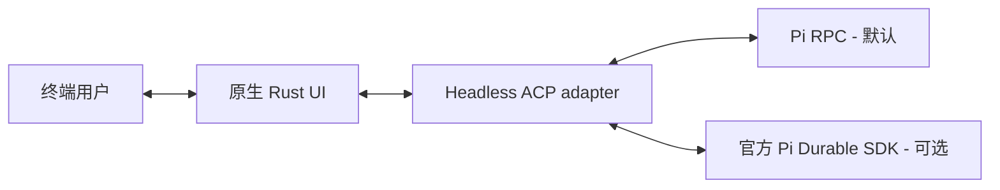

# grok-pi（pig）

**以 Pi 为 Agent 内核、在本仓库独立维护的原生 Rust 终端客户端。**

Pi 执行 Agent、模型、Provider 和工具；`pig` 提供终端界面，包括编辑器、设置、模型管理、会话导航、工具卡片、diff 与任务视图。Rust UI 最初派生于 Grok Build，现已形成自己的 Pi 集成与产品行为。

模型访问使用 Pi 凭据；产品入口不提供 Grok 账号、计费或语音控制。

[English](../README.md) · [Releases](https://github.com/kyrosle/grok-pi-tui/releases) · [更新日志](CHANGELOG.zh-CN.md) · [功能矩阵](FEATURE_MATRIX.md)

## 当前源码与已发布版本

截至 **2026-10-08**：

| 版本来源 | 实际内容 |
|---|---|
| [已发布 v0.1.10](https://github.com/kyrosle/grok-pi-tui/releases/tag/v0.1.10) | macOS 14+ Apple Silicon 二进制、`pig` 入口与随包动态库。发布早于下述运行时裁撤、Durable 和最新 Pi 1.1／原生 UI 改动。 |
| 当前开发源码 | 已移除自建 Eval，保留官方 Pi Codemode/MCP 集成；适配 Pi 1.1 契约、改进原生 viewer，并支持可选 Durable SDK 1.1.0 后端。这些改动尚未发布为二进制。 |

安装命令下载的是**已发布版本**。使用当前开发功能，需要构建这个 checkout。

## macOS 安装

已发布二进制支持 **macOS 14（Sonoma）及更高版本、Apple Silicon**。暂未发布 Intel Mac、Linux 或 Windows 二进制。

先准备 Node.js **22.19.0+** 并安装 [Pi](https://github.com/earendil-works/pi)，再安装 grok-pi。兼容最低版本是 Pi **1.0.0**；当前源码的新工具选择与运行时契约建议使用 **Pi 1.1.0+**。

```bash
npm install --global @earendil-works/pi-coding-agent
curl -fsSL https://github.com/kyrosle/grok-pi-tui/releases/latest/download/install.sh | sh
export PATH="$HOME/.local/bin:$PATH"
pig
```

安装器将 `grok-pi` 和动态库放到 `~/.local/bin`，创建 `pig`、`pi-grok` 符号链接。**日常直接使用 `pig`，无需 `tpig` 启动器。**需要时将 PATH 行添加一次到 `~/.zshrc`。可用 `GROK_PI_INSTALL_DIR` 指定安装目录。

固定安装 v0.1.10：

```bash
curl -fsSL https://github.com/kyrosle/grok-pi-tui/releases/download/v0.1.10/install.sh | \
  GROK_PI_VERSION=v0.1.10 sh
```

Release 提供安装包、SHA-256 校验文件，以及随包动态库的许可证和源码归档。默认 Pi RPC 模式启动后，通过 `/login` 登录 Provider，无需 Grok 账号。

## 日常使用

在要处理的项目目录启动：

```bash
pig
pig --continue
pig --help
```

默认后端使用 PATH 中的系统 `pi`。通过 `--pi-bin /path/to/pi` 或 `PI_BIN` 切换安装，通过 `--pi-cwd` 指定工作目录。

下表对应 **Pi RPC 模式**：

| 用途 | 入口 |
|---|---|
| UI 设置与语言 | F2 或 `/settings`；English、简体中文、跟随系统 |
| 模型与 Provider | `/model`、`/effort`、`/login`、`/logout`、`/pi-models` |
| 会话与上下文 | `/new`、`/resume`、`/rename`、`/session`、`/tree`、`/fork`、`/clone`、`/compact` |
| 资源与运行控制 | `/pi-config`、`/reload`、`/pi-runtime` |
| 历史与工具检查 | `/copy`、`/find`、`/transcript`、`/export`；原生工具卡片、diff 和全屏查看器 |
| 帮助 | `/hotkeys`、`/tutorial`、`/pi-ui-capabilities` |

`/pi-config web`、`/pi-models web` 打开本地配置工作台，管理 Pi 设置、Provider／模型、资源路径和 UI 设置。

```bash
pig update --check
pig update
pig update --channel beta
pig update --channel stable
```

更新来自本仓库的 GitHub Releases。`stable`／`beta` 选择保存在产品配置中，stable 排除预发布版本。`GROK_PI_NO_AUTO_UPDATE=1` 关闭后台检查。Release 更新不会安装未发布的 checkout。

## 当前源码为 Pi 增加了什么

| 能力 | 当前行为 |
|---|---|
| 原生终端 UI | Rust 输入与渲染、Markdown、工具卡片、review／diff、图片呈现、搜索、历史和全屏查看 |
| 产品设置 | 专用原生 F2 面板、中英文标签／搜索、主题与隔离配置 |
| 模型与资源管理 | 原生 Provider／模型编辑器、资源管理器、本地 Web 工作台、重载与运行控制 |
| 增强 Bash | 后台任务、输出收集、超时与进程树清理；默认开启 |
| Todo 与子代理 | 使用 Pi API 的 bundled 扩展，配合原生任务／子会话视图；默认开启 |
| 团队协作 | 可选 Subagents V2，提供稳定 agent 路径、消息和预设；默认关闭（[指南](usage/subagents-v2.zh-CN.md)） |
| 代码编排与 MCP | Pi 官方 Codemode、MCP／tool-search 扩展；通过 F2 选择启用，默认关闭 |
| Pi 1.1 适配 | `--tools` 增减选择、Pi 侧取消、执行耗时、分档价格与新版 Remote TUI 光标标记 |
| 终端状态 | 支持的终端接收 OSC 7501 working／blocked／done／error；`PI_PROGRAM_STATUS=1` 强制开启，`0` 关闭 |
| Durable | 可选官方 SDK 后端，提供持久任务与恢复；实验性，默认关闭 |

例如，在 **Pi 1.1+ 的 RPC 模式**下：

```bash
pig --tools +codemode,-bash
```

显式 CLI 工具选择优先于 F2 保存的偏好。

当前源码已移除自建 Eval v1/v2、Eval-only、Eval MCP 入口、重复实验选择器、第二套 Rust TUI Bridge 和启动 profiler。历史 Eval 卡片仍可读取；代码编排使用 Pi Codemode，Shell／Python 工作可通过 Bash 执行。

Goal／Loop、Q&A、Herdr 和 Rhai workflow 仍是可选产品扩展或集成，默认值分别管理。详细行为与限制见[功能矩阵](FEATURE_MATRIX.md)。

## 可选 Durable 模式

**仅当前开发源码支持。**F2 → Agent → **Durable 模式（实验性）**保存 `[ui].pi_durable`，默认 `false`，下次启动生效；当前会话继续使用原后端。CLI 仅覆盖本次运行的选择。

```bash
pig --durable
pig --durable --continue
pig --no-durable
pig --durable-background
```

Durable 使用官方 Pi SDK **1.1.0**、隔离 SQLite、已提交的消息／工具输出、inbox、任务图（`/tasks`）、官方 owned 前台子代理与 checkpoint 恢复。普通模式在关闭 UI 时暂停执行；显式 Unix 后台 owner 在界面断开后继续工作，一次接收一个 UI，没有 UI 且空闲 30 秒后退出。

不安全工具中断后，需要先检查副作用，再用 `/durable-recover continue` 或 `/durable-recover abort` 决策。恢复取消覆盖 store 中的中断工作。一个后台 owner 固定对应一个 store。

| 已支持 | 尚未适配 |
|---|---|
| 文本对话、read／write／edit／bash、前台子代理、模型／effort 选择、恢复会话、压缩、任务检查和恢复决策 | 普通 Pi 扩展、Codemode、MCP、图片、Plan／Goal／Loop、经典 tree／fork／clone 操作与登录 UI |

进入 Durable 前，通过普通 `pi` 的 `/login` 配置凭据。Skills／context 数据使用 Pi 公开 API，项目数据需要 `--approve`。RPC JSONL 与 Durable SQLite 会话保留在原后端，不热切换、不隐式转换；退出时按打印的后端专用命令恢复。

用 `GROK_PI_BUILD_DURABLE=1 ./build.sh` 构建可选 host。SDK／store 兼容范围和剩余工作见 [Durable SPEC](issues/架构/20261007-pi-durable-integration-SPEC.md) 与[实施记录](issues/架构/20261007-pi-durable-integration-PLAN.md)。

## Pi 插件与配置

普通 Pi packages、skills 和 extensions 在 **RPC 模式**运行。UI 兼容取决于 Pi RPC 暴露的能力：对话框／状态有原生映射，支持的 `ctx.ui.custom` 组件通过实验 Remote TUI host 展示；编辑器／自动补全 hooks 和部分组件方法仍有限制或不支持。`/pi-ui-capabilities` 可查看边界，安装了 Pi 插件不等于完整兼容其交互 UI。

开启原生功能时，pig 启动策略可能跳过已知冲突 package，但不会从 Pi 卸载它们。通过 `/pi-config` 与[冲突表](../crates/codegen/xai-grok-pager/assets/native_feature_conflicts.toml)检查策略。

| 数据 | 默认位置 |
|---|---|
| pig UI／产品设置 | `~/.grok-pi/config.toml` |
| 项目级产品配置 | `<project>/.grok-pi/` |
| Pi 凭据、模型、设置、packages 与 RPC 会话 | Pi 自己的 `~/.pi/agent/`，遵循 Pi 路径覆盖选项 |
| Durable stores | `$GROK_HOME/durable/`，按项目／store 隔离 |

`GROK_HOME` 覆盖 `~/.grok-pi`，`GROK_PROJECT_DIR` 覆盖 `.grok-pi`。默认不扫描 stock Grok 的 `~/.grok` 或项目 `.grok`；旧 `~/.tpig` 设置也不自动迁移。

RPC 诊断入口：

```bash
pig -ne --no-bridge-extensions
```

单独 `-ne` 只关闭扩展自动发现，显式 `-e` 和 bundled bridges 仍可能加载；上面的组合关闭两者。当前源码中，如果 F2 已开启 Durable，还需添加 `--no-durable`。Remote TUI 和增强 Bash 默认开启，可用 `PI_GROK_REMOTE_TUI=0`／`PI_GROK_BASH=0` 单次关闭。其他开关和策略见功能矩阵。

## 架构与项目来源



原生 Pager 负责终端与可见 UI。`pi-grok-adapter` 将后端事件转成 ACP，不渲染、不读键盘。默认后端使用 Pi RPC／Extension API，Durable 使用已发布 SDK；集成不修改 Pi 源码。

| 项目 | 关系 |
|---|---|
| [earendil-works/pi](https://github.com/earendil-works/pi) | Agent 内核依赖，提供官方 RPC、Extension API 与 Durable SDK |
| [xai-org/grok-build](https://github.com/xai-org/grok-build) | Rust Pager／组件的来源，选择性参考其 UI 改进 |
| [Dwsy/grok-pi-tui](https://github.com/Dwsy/grok-pi-tui) | fork 来源，选择性参考其集成与 UI patch |
| 本仓库 | 独立维护 Pi 产品入口、原生适配、bundled 集成、后端选择与发布 |

参考仓库按记录的 SHA 审阅，逐项判断是否引入；维护方式不包含整仓合并或逐文件字节同步。当前行为与插件兼容以本 checkout、测试和 capability 声明为准。[审阅水位](upstream/REVIEWED.json)同时记录已检查的源 SHA 与实际采用的本地 commit。

部分内部 crate 仍沿用继承的 `xai-*` 名称，以保留代码来源关系。

继承的部分依赖，以及 adapter 中的 queue／Plan／Goal／workflow 行为仍需迁移。[总纲 SPEC](issues/架构/20261003-pi-native-tui-SPEC.md)／[PLAN](issues/架构/20261003-pi-native-tui-PLAN.md)记录这些工作；当前版本不宣称整个架构目标已完成。

## 源码构建与文档

在仓库根目录操作。需要 `rust-toolchain.toml` 固定的 **Rust 1.94.0**、Node.js **22.19.0+**、npm、Python 3 和系统 Pi；macOS 的原生依赖还需要 Xcode Command Line Tools 或 Xcode。

```bash
./build.sh
./target/debug/grok-pi
# 使用其他项目目录：
./run-local.sh /path/to/project
```

可选 Durable 依赖：

```bash
GROK_PI_BUILD_DURABLE=1 ./build.sh
./target/debug/grok-pi --durable
```

使用系统 Pi 时，不需要初始化 `pi-main` submodule。`./build.sh` 选择 Pi 生产 feature profile 与共享 Cargo target。Cargo 命令使用 `./scripts/cargo-shared.sh`，默认至少保留 **20 GiB** 空间，并将生成目录控制在 **128 GiB** 内。验证入口为 `./verify.sh`，实际覆盖范围及剩余真人／Provider／终端检查见 [VERIFICATION](VERIFICATION.md)。

- [功能矩阵](FEATURE_MATRIX.md)：默认值、命令与兼容边界
- [架构](NATIVE_GROK_TUI_ALIGNMENT.md)：组件与后端所有权
- [Subagents V2](usage/subagents-v2.zh-CN.md) · [Herdr](usage/grok-pi-herdr.zh-CN.md)：可选集成
- [更新日志](CHANGELOG.zh-CN.md) · [贡献指南](../CONTRIBUTING.md)
- [LICENSE](../LICENSE) · [THIRD-PARTY-NOTICES](../THIRD-PARTY-NOTICES)：项目与继承依赖许可
