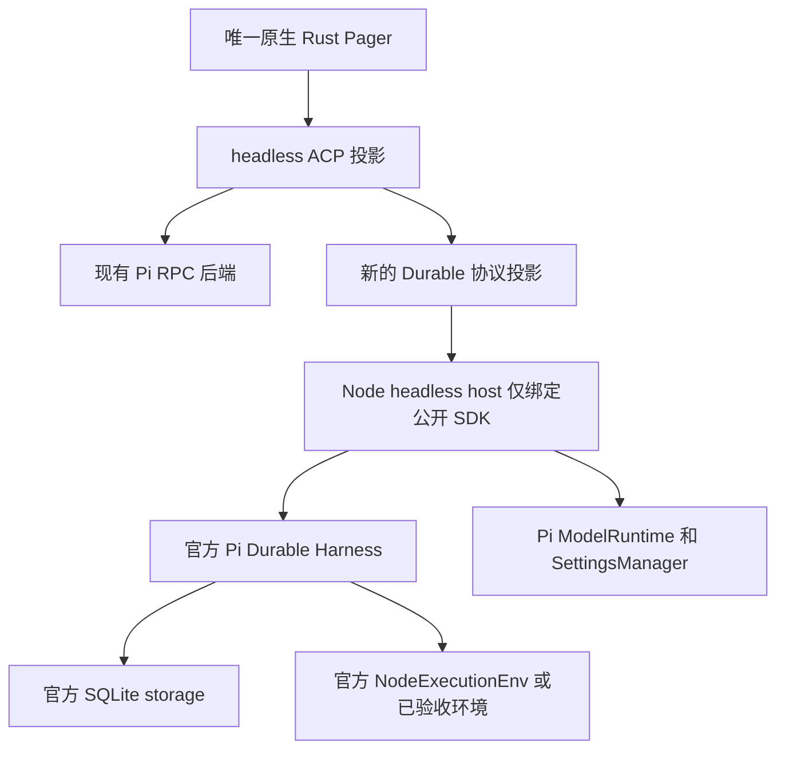

# Pi Durable 深度接入设计

结论：新增一个使用官方 Pi Durable Harness 的 headless 后端，复用当前 Rust Pager 与 ACP 投影。Durable 是显式开启、默认关闭的独立运行模式：不开保持当前 Pi RPC 行为，开启后才使用 Durable 会话、任务和恢复。两种模式长期共存，本子项不安排默认内核切换。任务、队列、恢复和子会话由 Durable 管理，pig 不重造调度器。

用户已授权按PLAN实施。官方参照与固定版本见 [SOURCE](20261007-pi-durable-integration-SOURCE.md)，步骤见 [PLAN](20261007-pi-durable-integration-PLAN.md)。保留当前四组裁撤的本地修改；SDK依赖安装在本项目运行时目录，验证使用隔离临时会话和synthetic provider。默认Pi RPC保持，不迁移真实会话，不调用收费模型；未另获授权不commit/push或替换已安装pig。

## 1. 官方参照和约束

普通 `pi --mode rpc` 仍使用 coding-agent，不是 Durable。官方 `coding-agent/src/experimental/durable` 是另一入口：ModelRuntime/SettingsManager、Registry、NodeExecutionEnv、SQLite、Harness、view/controller，最后连接 Pi TUI。

参考其三条边界：

1. Harness 是执行与数据权威；前端呈现已经提交的状态。
2. Controller 调用官方 submit/configure/abort/compact；视图订阅 conversation、inbox、live、usage 和 task graph。
3. 退出 UI、暂停运行和主动取消任务是不同操作。

官方实验版本没有普通扩展、Codemode/MCP、完整会话选择器、树导航和登录界面等完整接入。API 仍实验性，设计不把参考TUI的可运行范围当作pig功能全覆盖。

用户补充要求：Durable 作为可开启的 mode，关闭时和目前一样，grok-pi 代码提供相应支持。服从 [总体 SPEC](20261003-pi-native-tui-SPEC.md) 的单一产品、唯一官方Pi内核、原生UI、headless adapter和隔离状态树原则。经典RPC限定及SessionManager所有权适用于默认模式；可选Durable模式使用官方Harness和storage。T3/T4/T6的经典模式工作保持，新模式的协议和所有权按本子项实施。本草案不改变当前默认行为或声明总体T2–T8完成。

## 2. 架构



一个会话选择一种后端，两者不共同驱动同一会话。默认模式持续使用现有PiAgent；Durable模式不能失败后偷偷落回经典模式，否则会丢失其执行保证。

拟落点：

| 部分 | 路径方向 | 职责 |
|---|---|---|
| composition | `grok-pi.rs` / `grok_pi/durable_host.rs` | 选择后端、运行时版本、路径和进程所有者 |
| headless host | `runtime/pi-durable-host/` | 官方SDK初始化、API调用、JSONL/本地传输；不引入TS TUI |
| Durable→ACP | `pi-grok-adapter/src/durable/` | snapshot/event转换与短暂UI关联，复用原生组件 |
| Pager | 现有app/views/scrollback | 任务图、恢复状态、会话选择和控制入口 |

不先抽一个覆盖所有后端的巨型接口。新增DurableACP实现，与现有PiAgent在composition选择；真正公共的transport/UI纯函数才按现有代码复用。

### 2.1 模式入口与关闭保证

当前开发源码已接入F2持久配置与CLI单次覆盖；已安装的旧pig尚未替换。入口如下：

```text
F2 → Agent → Durable 模式：关闭 / 开启
提示：下次启动生效
```

使用现有设置registry和持久化链路，新增`[ui].pi_durable`，默认`false`、`restart_required=true`，中英文标签同步。它属于pig的运行时选择，不写入Pi的`settings.json`，也不作为某个Pi扩展的启用开关。F2在两种模式中都保留这行，关闭或开启都可操作。

```bash
pig                                      # 按已保存的设置启动；未配置时为当前 Pi RPC 模式
pig --durable                            # 新建 Durable 会话
pig --no-durable                         # 本次强制使用当前 Pi RPC 模式
pig --durable-background                  # Unix显式后台owner，关闭界面后继续执行
pig --durable --continue                  # 恢复当前工程最近的 Durable 会话
pig --durable --session <durable-locator>  # 恢复指定 Durable 会话
```

启动优先级：互斥的`--durable`/`--no-durable` → 现有effective config中的`[ui].pi_durable` → 默认`false`。CLI只覆盖本次，不改已保存值；不增加自动启用环境变量。未配置或配置关闭时保持当前Pi RPC路径。

F2修改的是下次启动的选择，当前已连接后端不变；沿用现有“下次启动生效”提示，并分别展示当前运行模式与已保存选择。Runtime模式和Plan/Goal、模型thinking是不同维度。首版不把正在运行的会话迁到另一内核，也不强制退出/取消任务；重新启动按设置或CLI选择，原会话保持原后端。若以后需要免退出切换，单独实现暂停/保留旧会话后打开新会话的生命周期，不能当成布尔设置的即时副作用。

| 项目 | 默认 Pi RPC | Durable 开启 |
|---|---|---|
| 启动 | 现有Pi版本检查、bootstrap、自愈、PiAgent | Durable host版本/capability握手、官方Harness |
| 普通Pi插件与host bridges | 保持当前发现、信任和注入规则 | 不执行未适配的旧ExtensionAPI工厂；按capability加载Durable项 |
| 会话和`--continue`/`/resume` | 当前Pi JSONL/session catalog | 当前工程Durable store/conversation catalog |
| 队列、任务和恢复 | 当前语义 | 官方inbox、TaskGraph和checkpoint |
| Durable依赖、数据库和owner | 不resolve SDK、不启动host、不建目录/锁/SQLite、不启动后台服务 | 仅此模式初始化；首版UI-owned |
| 原生界面 | 当前命令、F2、资源和工具入口 | 同一Pager，入口按Durable capabilities筛选 |

Durable是否被打包不影响关闭时的路径；仅当最终模式解析为开启时才进行SDK探测、数据库扫描或Durable项加载。依赖缺失、版本不兼容、store被其他owner占用时，Durable启动明确报错，给出修复、`--no-durable`临时退出或恢复入口，不自动换模式，也不自动改写F2配置。配置无效时沿用现有校验/报错规则，不能把非法值当成开启。

Durable的`--session`采用带backend/store/conversation身份的locator；默认模式继续支持现有Pi session file/UUID解析。两种模式明确拒绝另一后端的会话标识，不把它当成新会话创建。`--continue`与`/resume`仅查当前后端，避免打开错格式或触发隐式迁移。恢复提示明确包含对应的`--durable`或`--no-durable`，保存配置后来改变也能恢复原会话。`--session-dir`若开放在Durable模式下，表示Durable store根目录并明确独立格式；在支持前应报不支持，不静默忽略。`--fork`、`--session-id`、`--no-session`、显式`-e`和RPC passthrough等其他参数在新模式逐项声明支持或拒绝，默认模式的参数保持。

F2保留模式开关，运行状态显示当前模式；首版开关下次启动生效。Durable特有任务/恢复操作只在此模式且host capability为true时出现。旧功能若没有Durable处理器，从slash、palette、F2、Web目录和快捷键入口一起过滤；直接调用返回明确不支持。模式选择本身是pig拥有的配置能力，不能因当前后端缺少扩展API而被过滤。不能保留看似可用的经典设置并写入另一个后端。

### 2.2 当前代码需补的支撑

当前开发源码已增加独立Durable启动分支。实际改动入口如下：

| 当前位置 | 所需改动 |
|---|---|
| `grok_pi/cli.rs` | 互斥`--durable`/`--no-durable`解析、支持参数校验、按模式的帮助和capabilities |
| `UiConfig`、settings registry/defs、setters、translations、配置持久化 | 默认关闭的`pi_durable`布尔行、F2保存、中英文与重启提示；复用现有链路 |
| `grok-pi.rs::run` / `grok_pi/runtime_config.rs` | 解析CLI与effective config后，在config skill同步、桥接扩展物化、经典resource discovery及Pi bootstrap之前分流；关闭时保持原逻辑 |
| `grok_pi/durable_host.rs`与`runtime/pi-durable-host/` | 仅在开启时调用官方SDK、握手、单owner、路径和关闭；stdout专用协议、stderr诊断 |
| `pi-grok-adapter/src/durable/` | 单独ACP Agent、session身份、snapshot/事件、队列与任务投影；不套经典PiRpc自愈和queue mirror |
| Pager的`ExternalUiProfile`/`AcpConnection`及入口策略 | 复用现有外部Agent接入点；模式名称、原生命令/设置能力、任务/恢复入口和SessionPicker |
| 构建、macOS包、恢复提示与验证 | 可选host资源与固定依赖；正常模式无初始化回归，Durable模式独立故障/PTY验收 |

实现先做模式分流和最小可运行链路，再补深度功能；不会先加一个只改变UI名字的开关并宣称已支持Durable。

## 3. 数据与所有权

| 数据 | 权威 | 前端职责 |
|---|---|---|
| conversation、entry、fork、上下文边界 | Durable storage / Harness | SessionPicker、树/分支视图与只读缓存 |
| 运行generation、tool task、retry、compaction | `pi.live`和官方tasks | banner、工具卡片、状态、取消入口 |
| steering/follow-up和提交回执 | `pi.inbox` / Submission | 展示、提交、撤回；未提交草稿留在编辑器 |
| 模型/thinking/cwd/工具选择 | `pi.agent` | 原生选择器，调用configure |
| tokens与费用 | `pi.usage` | 状态栏和统计；不冒称账单数据 |
| 子会话、父子任务和依赖 | Harness ownership / TaskGraph | dashboard/任务面板，不再维护另一套运行状态 |
| credentials、provider方法 | Pi ModelRuntime | 现有原生对话框薄桥；不进Durable数据库 |
| UI外观、窗口、草稿 | pig | product-isolated配置 |

默认存储候选：`$GROK_HOME/durable/<canonical-cwd-hash>/<store-id>/session.sqlite`。每个store有稳定ID，其conversation/entry/task ID只在此store内解释；ACP标识同时携带backend/store/conversation身份。

使用官方Node SQLite adapter；Rust不查内部SQL表。单store单owner，文件锁和本地连接权限保护所有权。首版按官方WAL/NORMAL默认验证进程崩溃恢复，不能据此承诺突然断电不丢已提交记录；需要断电等级保证时，另验证公开数据库API设置FULL的方案。

旧Pi JSONL会话不转换、不覆盖。SessionPicker仅列当前模式会话，恢复到相同后端；切换模式后各自历史仍可访问。将来导入只可写入新store并通过官方事务API保留来源关联，不能迁移旧进程/工具的活句柄。格式升级需要锁定SDK版本、备份及退出方案。

## 4. 传输与原生投影

首版用本地JSONL headless host，借鉴官方 `19-json`。这是pig自有的Durable协议，不修改或伪装Pi官方RPC，也不导入实验TUI私有模块。

最小协议能力：handshake/capabilities、open/attach/detach/close、submit/status/withdraw、conversation snapshot/watch、configure、abort、compact、会话/任务列表和选择。响应关联传输request ID；输入提交使用独立、稳定的Durable `requestId`，断线重试同一提交不能换ID。

| 官方状态或API | pig原生呈现 |
|---|---|
| `Conversation.viewState()` / `watchEvents().snapshot` | 恢复历史和运行状态；按身份替换视图，不能追加成重复消息 |
| committed `message_*` / `changes[]` | Markdown/thinking流，正确合并不同于经典RPC的delta结构 |
| tool start/update/end与output trim/append/set | 工具卡片、输出、diff；按真实tool ID去重 |
| inbox与submission终态 | 队列、撤回、完成/无答案/中断提示 |
| `Harness.taskGraph()` | 现有任务面板，展示依赖/所有者/后台anchor |
| agent/usage/compaction更新 | 模型、thinking、费用、压缩状态和设置 |

以SDK原子snapshot+watch接入，不另加文件轮询。wire epoch/sequence只标识本次传输顺序，不冒称SDK的持久commit游标；重连获取新snapshot。消费者落后时，接受官方snapshot重置，在一致性恢复前不继续混用旧delta。

完成条件依据Submission和run的官方状态，不机械复用经典 `agent_settled`。模型/工具更新以commit派生数据为准，TUI不提前显示未提交的执行成功。

Durable fork是新conversation分支，不能假装经典SessionManager原地navigateTree/leaf切换。先复用原生树组件显示真实关系和“从此处分支”，按capability区分语义。

## 5. 恢复、取消和后台生命周期

必须分清：等待超时/取消客户端wait、withdraw queued submission、abort当前conversation、abort含后台后代、暂停host、detach UI。官方wait取消不取消工作；关闭Harness会保留待恢复状态，不能被通用Drop改成用户abort。

默认复用官方实验的UI-owned host：退出后工作暂停，下一次打开store恢复。显式`--durable-background`启用同一个host的Unix socket owner，界面断开只detach，不关闭Harness；可重连。单store单owner、单活跃UI，store锁和私有socket目录排他；没有界面且任务空闲30秒后退出。当前使用标准进程组和SDK锁，launchd自动重启未实施，不能宣称无人值守掉线自愈。

深度后台阶段仍复用同一headless host代码：一个store一个常驻owner，UI只是可重连client。macOS优先评估launchd等原生进程管理；不编写另一套模型调度/重试/唤醒引擎。继续运行需要owner实际存活；无owner时任务只会持久等待。

| 中断点 | 规则 |
|---|---|
| commit前断连 | 不宣称已接收；同一client按原requestId查询/重试 |
| commit后ACK丢失 | 同requestId找回同Submission，不能重复启动任务 |
| UI崩溃/重新附着 | 取snapshot，恢复呈现，不重新发送历史输入 |
| owner崩溃/优雅暂停 | 按官方checkpoint恢复，不把部分输出误判为最终结果 |
| 工具intent之后中断 | 尊重已存和当前replay策略；仅两者均safe才重放 |
| bash/write/edit/外部MCP状态不确定 | 默认unsafe/interrupted，显示部分执行事实与操作边界 |

Durable不是所有外部副作用的exactly-once系统。即使SDK不重放unsafe tool，模型也可能提出新调用；有未知副作用时需要在官方hook/application document中暂停危险调用并等待明确恢复决策。不能把所有旧插件工具标成safe。

数据库恢复不会让旧shell PID、MCP连接或JS对象自动存活。SIGKILL后的外部子进程状态需单独验证；不能按裸PID杀进程或盲目重跑。后台Bash重新打开时首先标示interrupted/unknown，直到已验收的执行环境能给出可靠收据。

前台Subagent参考官方ownerTaskId+稳定子提交ID；后台参考background anchor+reporter task。TaskGraph是统一权威，不混用现有SDK child session ID和Durable conversation ID。Goal/Loop若迁移，使用官方Task定义与checkpoint/sleep；不把旧内存timer称为durable计划任务。

## 6. 公共API与兼容门槛

固定 `pi-durable/pi-ai/chord/coding-agent` 兼容版本与锁文件，不随系统Pi升级静默替换运行中store的SDK。参考版本为1.0.4，但升级策略由实现验收确定。Node>=22.19.0；数据层使用其公开 `node:sqlite` adapter，首版不宣称Bun等价。

参考示例的HTTP初始化、prompt构造和模型解析含内部imports。只从公开package exports调用ModelRuntime/SettingsManager等；缺口先做spike，必要时用已有HTTP库正式API作薄配置映射，或推动公开上游接口。不给未公开内部路径/prototype patch永久豁免。

经典Pi ExtensionAPI不等于Durable defineExtension。capabilities必须准确报告：未适配的插件/工具不执行，不静默回退经典内核。原生theme/skill数据和终端快捷键呈现可独立复用。

| 当前已安装功能 | Durable首版策略 |
|---|---|
| Pi CodingTools read/write/edit/bash | 使用官方Durable工具；无自建Eval；unsafe恢复策略保持 |
| Codemode/MCP/tool-search | 官方Durable尚无完整同等接入；公开API/任务归属验证前capability=false，仅影响新模式；默认Pi RPC保持当前支持 |
| pi-web-access / multi-edit | 工具逐个适配，检查参数/结果/权限/replay；不直接执行旧工厂 |
| Hermes memory / context-curator | 上下文与会话契约差异大，单独适配及数据验收 |
| Ponytail / autoresearch | 静态skills可复用；运行hook/实验回路需要Durable任务适配 |
| pi-themes | 复用数据与原生主题导入，不引入TS TUI |
| skill-selector / thinking-steps / session-manager / cache-graph | 以已具备的原生组件为主，不再次挂Pi原生编辑器补丁 |
| Shop / Expert Council / native Subagents | 单一选定的编排路径接到官方owned conversations/tasks；不透明混跑多套身份与调度 |

鉴权通过Pi ModelRuntime与现有QuestionView；Durable无经典ExtensionUIContext时不能靠伪造ctx实现所有插件接口。高级自定义UI、图片工具、tools/prompt-template加载、树、web配置与OAuth必须单独列能力及测试，不依据SDK包名推断兼容。

## 7. 两种模式的验收

| ID | 必须成立 |
|---|---|
| DU-01 | renderer/adapter无Durable调度器、业务队列或SQLite表写入；依赖来自官方SDK |
| DU-02 | admit/ACK丢失/重复requestId/重连snapshot不产生重复提交和重复UI行 |
| DU-03 | SQLite checkpoint、SIGKILL/关闭/重开、多owner排他有实际故障注入证据 |
| DU-04 | safe重放和unsafe中断结果分别验证；shell/MCP/文件副作用不被重复执行或掩盖 |
| DU-05 | 前台/后台子任务所有权、abort传播、UI detach和owner close语义准确 |
| DU-06 | transcript、任务图、tool output/diff、模型/thinking、usage/inbox/compaction由原生组件呈现 |
| DU-07 | classic会话与用户状态不被迁移/改写；store版本升级有验证和恢复策略 |
| DU-08 | 插件与公开API兼容表有实测，所有入口按当前后端capabilities呈现；未支持能力不静默落回经典RPC |
| DU-09 | no-inference SDK测试、真实host→ACP测试、原生PTY、真人provider/OAuth分别记录 |
| DU-10 | 最终模式为关闭时行为保持，缺失SDK也可正常启动；不创建Durable目录/DB/锁、不启动host/后台服务，经典会话和插件回归通过 |
| DU-11 | 模式启动时固定；`--continue`/`/resume`/恢复提示按当前后端，跨模式locator明确拒绝；失败不更改模式或迁移真实会话 |
| DU-12 | F2开关两种模式都可见并可保存；默认false、CLI覆盖/冲突/effective config优先级、失败回滚正确；更改仅下次启动生效，当前任务不被取消或迁移 |

交付目标是默认模式保持当前功能、可选Durable模式具备明确可用范围和恢复保证。实验交付可以暴露经过验收的最小能力集合，其余如实标注；深度接入按PLAN补齐。该子项不删除经典后端、不改默认模式；任何未来默认策略变更均需新的明确需求。
